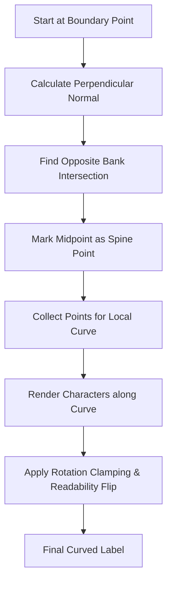

# BroCodes
HackArena 3.0

## WKT Canvas Demo

### Run
1. Install dependencies: `pip install flask shapely`
2. Start the server: `python app.py`
3. Open `http://127.0.0.1:5000/`
---

## Technical Report: Perpendicular-Curved Map Labeling

### 1. Perpendicular Scanning (Midline Detection)
- **Normal Projection**: We project perpendicular lines from one bank to the other to find the exact geometric "bridge" across the water.
- **Spine Detection**: Midpoints of these bridges form a smooth "spine" (the skeleton) for label anchoring.
- **Boundary Marking**: Visited points on both banks are marked to ensure efficient, non-redundant scanning.

### 2. Curved Text & Readability
- **Path-Following**: Labels follow the 3-point local curve of the spine. Each character is individually rotated.
- **Rotation Clamping**: To avoid neck-straining vertical text, we gradually bias labels towards horizontal, even in vertical river segments.
- **Readability Flip**: Automatically flips text 180° if it would appear upside-down, keeping it consistently right-side-up.

### 3. Visual Debugging
- **"Show Points"**: Toggle to see the raw vertices and the calculated spine midpoints.
- **Viewport Buffering**: Pre-renders labels 150px beyond the view so they appear seamlessly during pan.

### 4. How it diffrentiates

### Difference from basic approaches
| Feature | Centroid/Grid Based | Perpendicular-Curved (Ours) |
| :--- | :--- | :--- |
| **Logic** | Fixed points or grid search. | Dynamic boundary-to-boundary "bridge" scanning. |
| **Placement** | Straight labels at wide spots. | Curved labels that follow the river's bend. |
| **Readability** | Jitters near vertical flows. | "No-Vertical" clamping and "Readability Flip". |
| **Efficiency** | O(N*M) grid search. | O(N) boundary traversal. |

### The Revised Algorithm Flow

